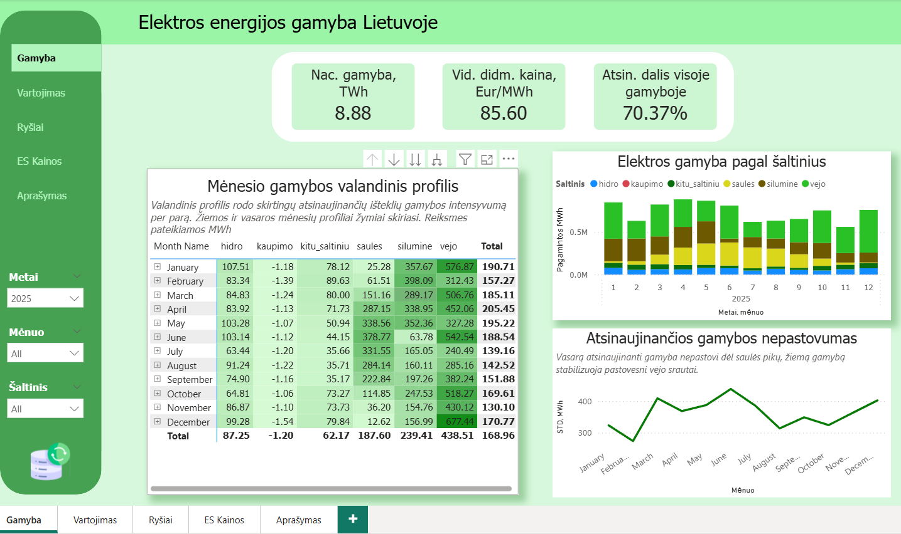
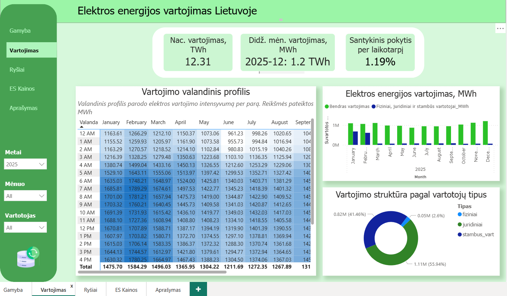

# Data-visuals-portf-MA
**Data analysis and visualisation**

This project analyzes electricity production, consumption, and pricing trends in Lithuania using publicly available data (period 2023-2025).
The objective was to explore the relationship between supply, demand, and price fluctuations, and to identify key seasonal and structural patterns in the electricity market.
The analysis focuses on renewable energy volatility, consumption dynamics, and price differences within the EU.

## Electricity production

Electricity generation from renewable sources is increasing; however, it remains volatile.  
During periods of production shortages, electricity is either imported or generated in thermal power plants.

## Electricity consumption

Electricity consumption still exceeds domestic production, although the negative balance is gradually decreasing each year.  
Consumption patterns are more predictable compared to production.
 
## Relation between production, consumption and prices

Price spikes often coincide with declines in renewable energy generation.  
Electricity prices are influenced not only by supply fluctuations but also by changes in consumption (e.g., winter periods).

## Aditional: prices in EU Countries

Wholesale electricity prices in Scandinavian countries are significantly lower compared to the Baltic states.  
Next step of analysis: identifying the reasons for the difference.

## Limitations of the project

This analysis is based on publicly available data and does not include additional factors such as fuel prices, cross-border electricity trade, regulatory interventions, or geopolitical influence.
The model demonstrates simplified market dynamics by focusing primarily on production and consumption indicators.
